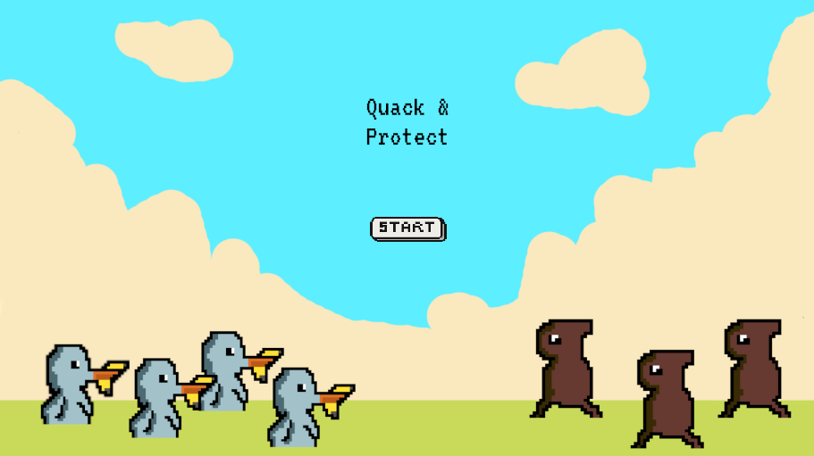
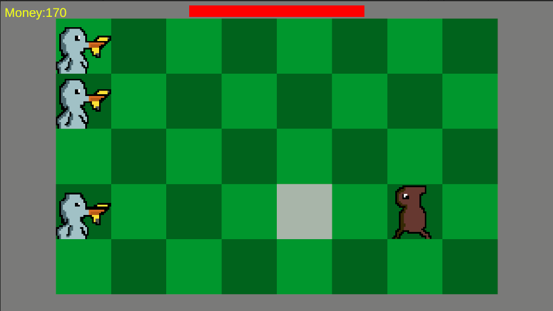
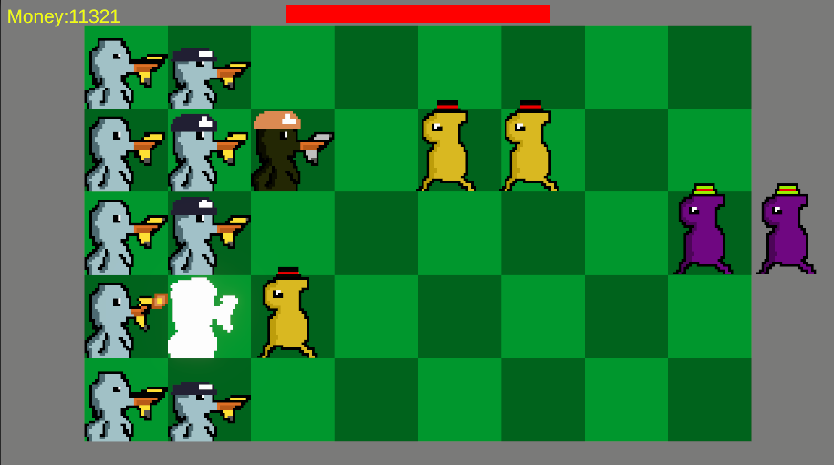
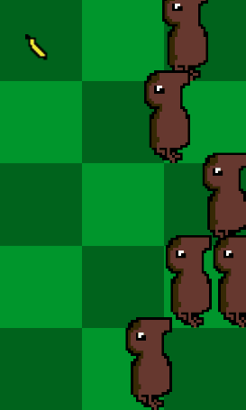
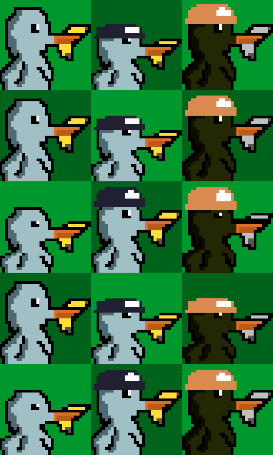
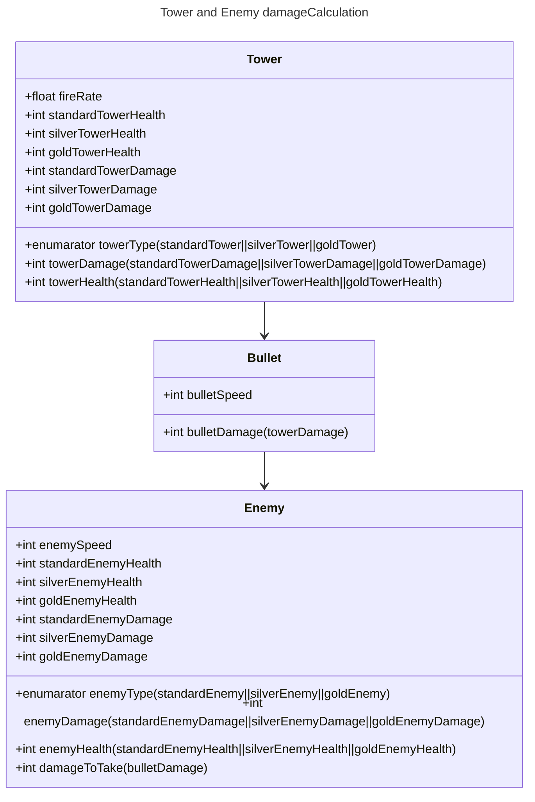

# QuackAndProtextCGIlog
*Ik heb een simpele tower defense game gemaakt met plantsVSzombies gameplay genaamd Quack and Protect*

## Product 1: "DRY SRP Scripts op GitHub"

*in dit script voor mijn tower gebruik ik het Dont Repeat Yourself(DRY) principe door alle variablen gameobject in preregisterd variabelen te zetten en daaruit de components die ik ervan nodig heb te pakken
[script](Towerdefense/Assets/Scripts/TowerScripts/Tower.cs)*

## Product 2: "Projectmappen op GitHub"

*Dit is de [ROOT](Towerdefense/) folder van mijn unity project.*

## Product 3: Build op Github
*hier een link naar de final release
[Release](https://github.com/erwinhenraat/TowerDefenseTemplate/releases](https://github.com/isheeSAURUS2/TowerDefenseSchool/releases/tag/final))*

## Product 4: Game met Sprites(animations) en Textures 

*Animations van de enemy en towers*

## Product 5: Issues met debug screenshots op GitHub 

*ik heb helaas maar een issue omdat ik alle bugs die ik tegenkwam snel heb gefixt
[Hier de link naar mijn issues](https://github.com/isheeSAURUS2/TowerDefenseSchool/issues?q=is%3Aissue+is%3Aclosed)*

## Product 6: Game design met onderbouwing 

*hier mijn origenele idee voor de game in een simpele GDD*

# Tower defense
PVZ rip-off
    -4 Lanes
    -4 towers(banaan)
    -4 enemy(aap)
## Enemy's
    -basic aap
        -laag hp
        -laag damage aan towers
        -simple animaties
            -walking
            -attacking
            -dying
    -armored aap
        -hogere hp
        -zelde damage als basic
        -maak basic aap silver
    -attack aap
        -meer damage dan basic
        -zelfde hp als basic
        -maak basic aap met helm
    -goated aap
        -meer damage
        -meer hp
        -maak aap goud met helm
## Towers
    -basic banaan    
        -laag hp
        -laag attack
        -basic animaties
            -schieten
            -doodgaan
    -broze banaan
        -iets hogere hp
        -iets hoger attack
        -basic animaties maar dan bruin
    -zilvere banaan
        -nog iets hogere hp
        -nog iets hogere Attack
        -basic banaan maar dan grijs
    -goude banaan
        -you know the drill

*  **Je game bevat torens die kunnen mikken en schieten op een bewegend doel.** 

*Mijn towers komen in 3 verschillende varianten en kunnen geplaatst worden op een van de 5 lanes de towers schieten voor zich uit als ze een enemy op hun lane detecteren
Ze komen in de variante standard silver en gold elke tower variant is een soort van upgrade en hebben allemaal meer HP&&DMG dan de vorige variant*

*  **Je game bevat vernietigbare vijanden die 1 of meerderen paden kunnen volgen.**  

*mijn enemys komen ook in drie verschillende varianten en worden randomly op een van de lanes gespawned netzoals bij de tower komen de enemys in 3 varianten standard, silver en gold
en net zoals de tower is elke hoger in HP&&DMG*

*  **Je game bevat een “wave” systeem waarmee er onder bepaalde voorwaarden (tijd/vijanden op) nieuwe waves met vijanden het veld in komen.**

*mijn wave systeem werk op tijd gebaseerde mechanics de langer je overleeft de moeilijker het wordt elke 35 seconden wordt het maximale aantal enemys wat in een keer kan spawnen hoger en de tijd tussen spawns iets lager ook komer er na de eerste 2 minuten silvere enemys bij en dan 2 minuten daarna gold enemys*

*  **Een “health” systeem waarmee je levens kunt verliezen als vijanden hun doel bereiken en zodoende het spel kunt verliezen.** 

*er is een healthbar die laat zien hoeveel health de player heeft de hp value kan je niet zien ingame je verliest health als een enemy het einde van het scherm haalt*

*  **Een “resource” systeem waarmee je resources kunt verdienen waarmee je torens kunt kopen en .evt upgraden.**

*er is een money system die je elke seconde 2 money geeft waar je towers mee kan kopen ook geven enemys 100 money als ze dood gaan*

*  **Een “upgrade” systeem om je torens te verbeteren.**

*mijn towers kan je niet upgraden om in de spirit van PVZ1 te blijven*

## Product 7: Class Diagram voor volledige codebase 
Class Diagram van de damage en health calculations tussen enemys en towers gemaakt met de [mermaid tool](https://mermaid.js.org/syntax/classDiagram.html) 

## Product 8: Prototype test video 
*Hier is een test video van mijn game!:*

## Product 9: SCRUM planning inschatting 

*ik heb op mijn trello storypoints gebruikt voor het inschatten van de tijd op userstorys ik gebruik 0-10 storypoints
[Link trello](https://trello.com/b/aGEzcIRM/towerdefense)*

## Product 10: Gitflow conventions

*ik heb dit leerdoel niet bereikt helaas in het volgende project ga ik zorgen dat het goed komt*

